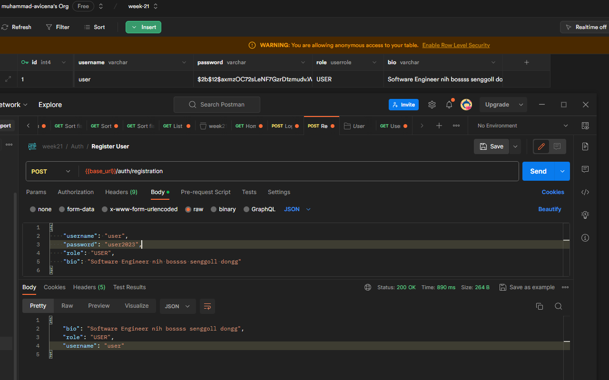

[](https://avicena.dev/)

<h1 align="center">Fancy to see you here  </h1>

hi, I'm Muhammad Avicena. In this repo, I build a simple back-end API with Hexagonal Architecture using Flask-python. If you have any question or feedback, hit me up at anytime !

I am committed to staying up-to-date with industry trends and using the latest tools to develop innovative solutions that surpass expectations.
Interested to have collaboration ? Find me on:

[](https://www.linkedin.com/in/muhammad-avicena/)
[](https://www.youtube.com/@MuhammadAvicena)
[](https://www.instagram.com/ryuhideaki.dev/)
[](mailto:cenarahmant.dev@gmail.com)

## INGREDIENTS I USE 📜

- App
  - Python
  - Flask
  - SQLAlchemy

## HOW TO SET UP 📰

You will need a github account to clone this repository, make sure you're connected to github.

```bash
# Clone this repository or simply fork it.

- git clone https://github.com/RevoU-FSSE-2/week-17-muhammad-avicena.git

# Install depedencies

- pipenv install

# Set up the .env file, follow the template from `.env.example`.

    DATABASE_URL = ""
    SECRET_KEY = ""
    FLASK_ENV = "development"

# Run the application

- pipenv run flask run --debug
```

## AVAILABLE API 📰

**Endpoint :** [https://us-central1-revou-fullstack.cloudfunctions.net/week_17_avicena](https://us-central1-revou-fullstack.cloudfunctions.net/week_17_avicena)

| Name                 | HTTP Method | Endpoint             | Requirements                                                                            |
| -------------------- | ----------- | -------------------- | --------------------------------------------------------------------------------------- |
| **Login User**       | `POST`      | /auth/login          | Request Body: `username: string, password: string`                                      |
| **Register User**    | `POST`      | /auth/registration   | Request Body: `username: string, password: string`                                      |
| **Get User Profile** | `GET`       | /user                | Request Headers: `Bearer Token`                                                         |
| **Post a Tweet**     | `POST`      | /tweet               | Request Headers: `Bearer Token`, Request Body: `tweet: string`                          |
| **Following**        | `POST`      | /api/v1/participants | Request Headers: `Bearer Token`, Request Body: `user_id_to_follow: user_id_to_unfollow` |

## SQLALCHEMY DATABASE USING SUPABASE⚙️



I have successfully connected with Open-Source database named Supabase, it's super easy to use !

Feel free to explore the website and try out the different features. I appreciate any feedback and suggestions to further improve the user experience.
